<div align="center">
  
  <h1>WaterWatch</h1>
  <p><strong>A Web-Based Geospatial Information System for Mapping and Managing Community Water Resources — Ilorin Metropolis, Kwara State.</strong></p>
  <p>
    <a href="https://waterwatch-ilorin.vercel.app" target="_blank"></a>
    
    
    
    
  </p>
</div>

---

## Overview

WaterWatch is a full-stack web-based Geographic Information System (GIS) that enables citizens to **discover**, **report**, and **monitor** community water infrastructure across the three Local Government Areas of the Ilorin Metropolis (Ilorin West, Ilorin East, and Ilorin South).

The platform bridges a critical information gap: water infrastructure data in many Nigerian communities is stored in static offline registers that quickly become outdated. WaterWatch replaces this with a **live, crowdsourced digital asset register** — citizens report faults through their smartphones, administrators verify and resolve them, and the public map reflects the ground truth in real time.

> **Academic Context:** This system was developed as a final-year undergraduate project for the Department of Information Technology, Faculty of Communication and Information Sciences, University of Ilorin (2025/2026).

---

## Table of Contents

- [Live Demo](#live-demo)
- [Key Features](#key-features)
- [Screenshots](#screenshots)
- [Architecture](#architecture)
- [Technology Stack](#technology-stack)
- [Getting Started](#getting-started)
- [Environment Variables](#environment-variables)
- [Project Structure](#project-structure)
- [API Overview](#api-overview)
- [Security](#security)
- [Acknowledgements](#acknowledgements)

---

## Live Demo

| Interface | URL |
|---|---|
| Public Map & Landing Page | [waterwatch-ilorin.vercel.app](https://waterwatch-ilorin.vercel.app) |
| Citizen Portal | [waterwatch-ilorin.vercel.app/citizen](https://waterwatch-ilorin.vercel.app/citizen) |
| Admin Dashboard | [waterwatch-ilorin.vercel.app/login](https://waterwatch-ilorin.vercel.app/login) |
| Backend API | Hosted on Render |
| API Documentation (Swagger) | `<backend-url>/api-docs` |

---

## Key Features

### Public
- **Interactive Leaflet Map** — browse all registered water points (boreholes, wells, public taps) across Ilorin, colour-coded by status (functional / faulty / under repair)
- **Status & Type Filters** — narrow the map view instantly by waterpoint status or type
- **Waterpoint Detail Panel** — click any marker to view name, type, community, LGA, photo carousel (up to 5 images), coordinates, and a one-click Google Maps directions link

### Citizen (Authenticated)
- **LGA-Scoped Dashboard** — overview statistics and waterpoints scoped to the citizen's registered Local Government Area
- **Fault Reporting** — submit a fault report with GPS coordinates (progressive multi-stage capture: Wi-Fi shot + GPS watch + cache + IP fallback), photo upload via Cloudinary, and optional waterpoint linkage
- **My Reports** — track the status of all personal submissions (pending → verified → resolved / dismissed)
- **Community Feed** — post and read community updates and observations scoped to the citizen's LGA

### Administrator
- **Dashboard Overview** — live KPI cards (total waterpoints, functional %, faulty, under repair), animated infrastructure health donut chart, fault reports pipeline, and recently updated waterpoints table
- **Waterpoint Management** — full CRUD for water infrastructure with multi-photo upload, coordinates, community, and LGA
- **Fault Report Auditing** — review, verify, dismiss, or resolve citizen-submitted reports with resolution notes
- **Deduplication / Data Integrity Portal** — review automatically flagged near-duplicate submissions side-by-side; merge or keep distinct entries; run database-wide proximity audit scans with configurable scope
- **User Management** — view all registered citizen accounts; suspend, block, or reactivate accounts
- **Invite-Based Admin Onboarding** — create time-limited cryptographic invite tokens for new administrators; revoke unused invites
- **Configurable System Settings** — adjust proximity thresholds (auto-flag, community review, audit scope) at runtime with a real-time SVG proximity visualizer

---

## Screenshots

### Landing Page
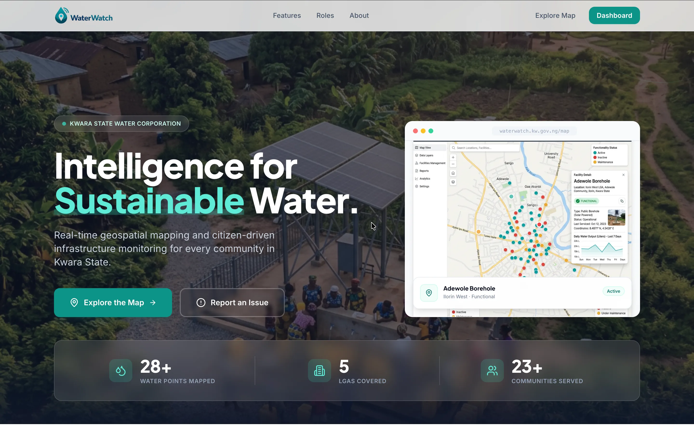

---

### Interactive Map Dashboard
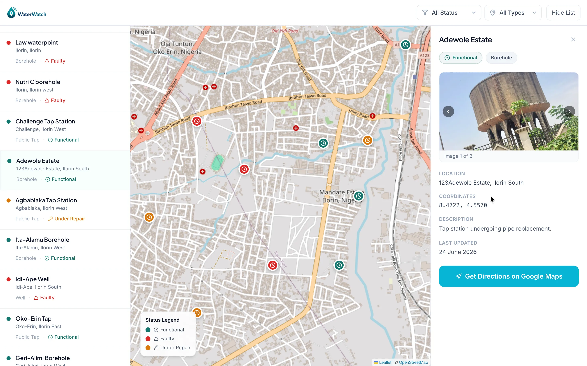

The map is centred on the Ilorin Metropolis. Colour-coded circular markers plot each waterpoint's GPS location. The left sidebar lists all visible waterpoints; the right panel shows detail for the selected point including a photo carousel, coordinates, and a Google Maps directions button.

---

### Citizen Fault Report Form
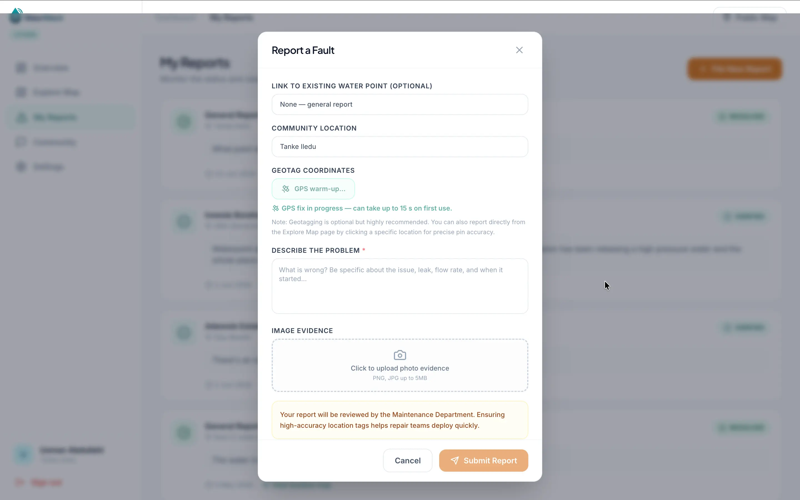

Citizens submit fault reports with optional GPS coordinates (progressive capture shown: "GPS fix in progress — can take up to 15 s on first use"), a fault description, and photo evidence uploaded to Cloudinary.

---

### Admin Dashboard Overview
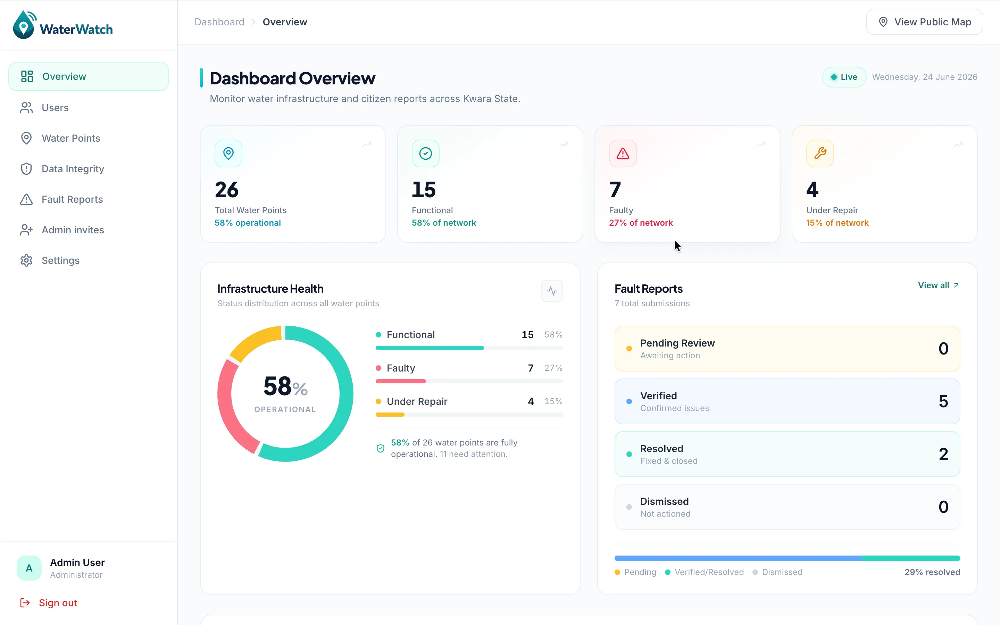

Live KPI cards, an animated infrastructure health donut chart (58% operational), fault report pipeline rows, and a recently-updated waterpoints table. All statistics animate in on page load.

---

### Admin Login
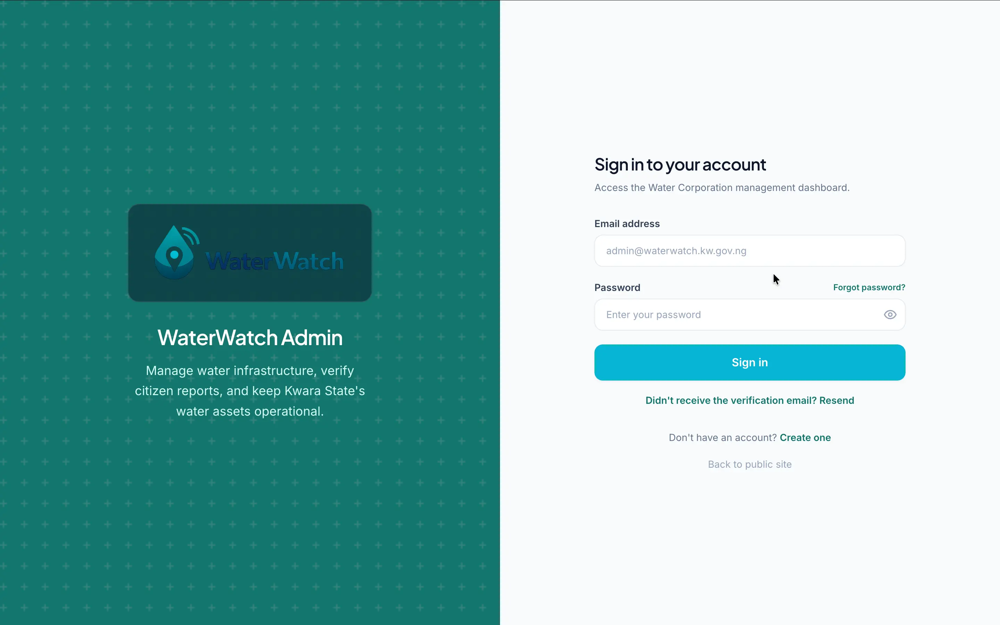

Secure two-panel login page for administrators. Email and password are validated server-side; accounts must have a verified email before login is permitted. Includes forgot-password and verification-resend links.

---

### Citizen Dashboard Overview
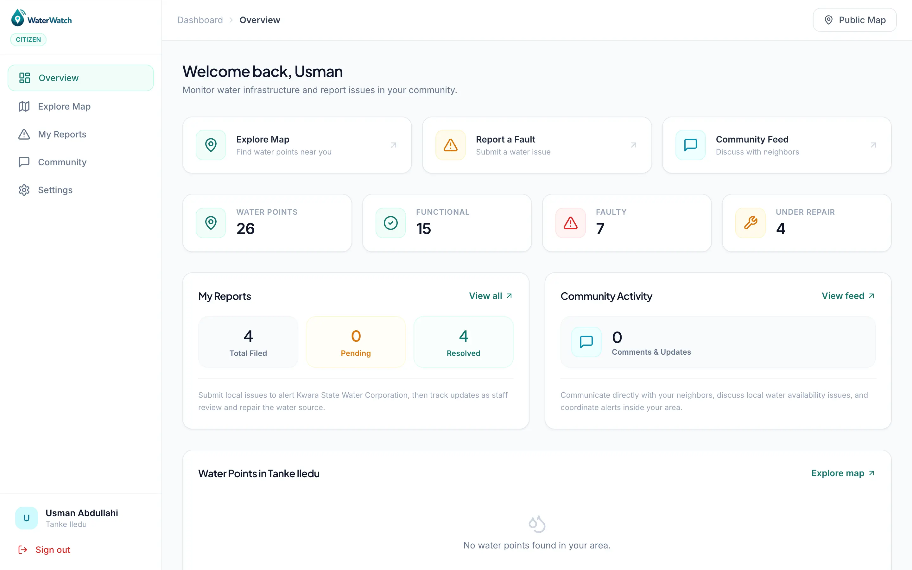

Personalised citizen dashboard showing system-wide infrastructure stats, the citizen's own report history (filed / pending / resolved), quick-access cards for the map and fault reporting, community activity feed summary, and nearby waterpoints in the citizen's LGA.

---

### Admin Fault Reports
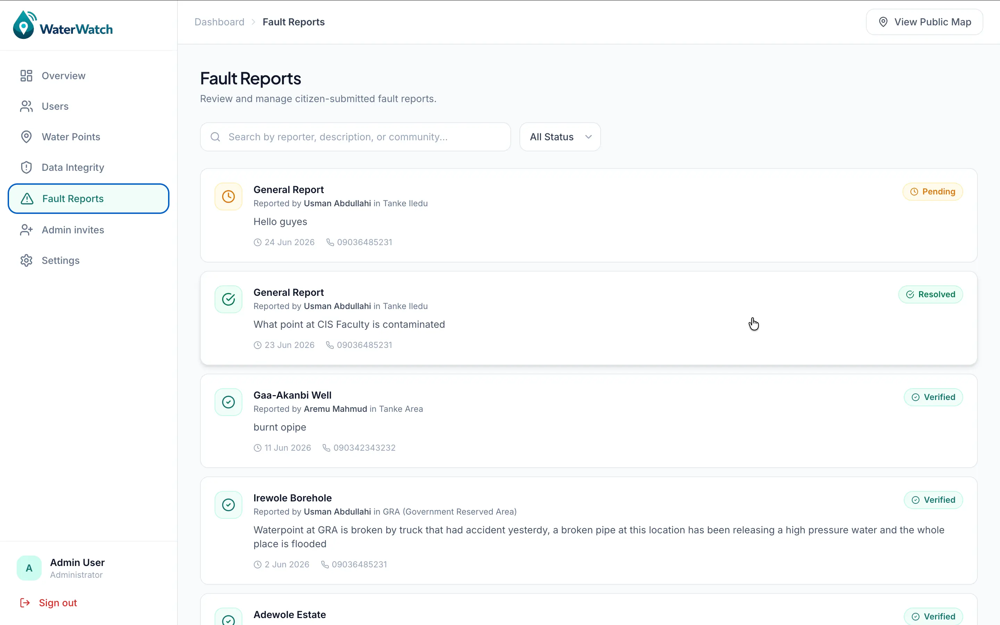

Paginated, searchable list of all citizen-submitted fault reports. Each entry shows reporter name, community, description, current status badge (Pending / Verified / Resolved / Dismissed), and timestamps. Admins can open each report for full detail and take a review action.

---

### Data Integrity / Deduplication Portal
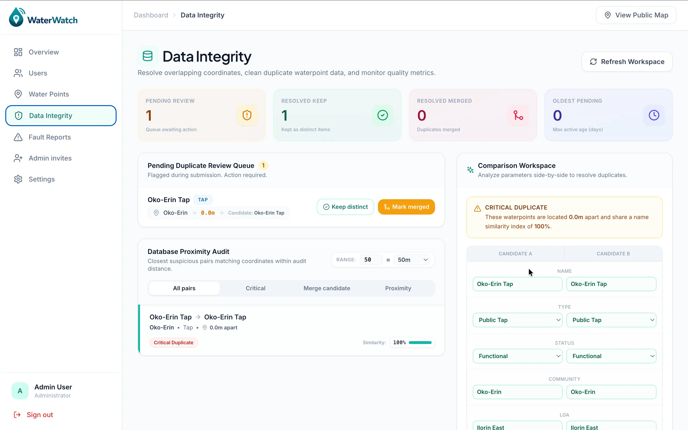

Automatically flagged near-duplicate waterpoints appear in a review queue. The comparison workspace shows both candidate entries side by side with the measured distance between them, a name similarity score, and a critical-duplicate warning. Admins click **Keep Distinct** or **Mark Merged** to resolve.

---

### System Settings
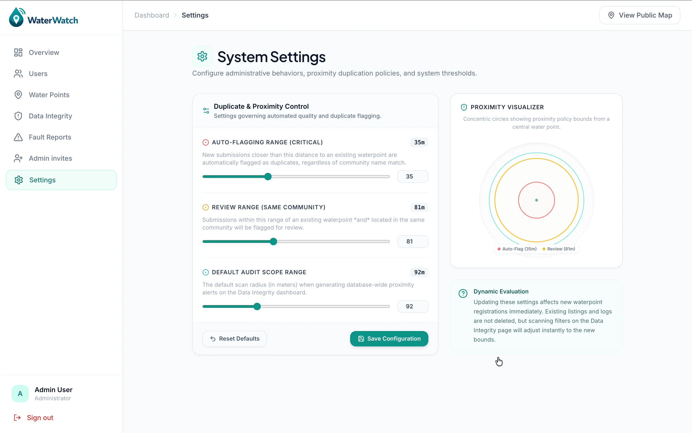

Runtime-configurable deduplication thresholds with slider + numeric input controls. The SVG proximity visualizer on the right renders concentric circles representing the auto-flagging range (red), review range (amber), and audit scope (teal), updating live as sliders move.

---

### User Management
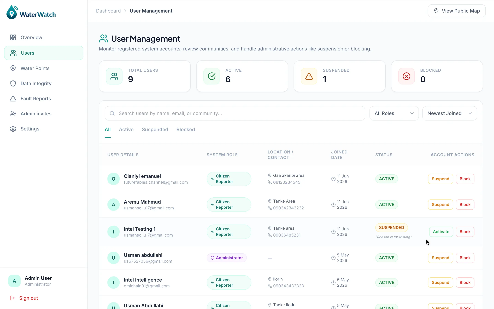

Full citizen account oversight: total / active / suspended / blocked counts, searchable user table showing name, email, LGA, role, and account status, with inline Suspend / Block / Activate controls. Suspended accounts show the reason inline.

---

### Community Feed
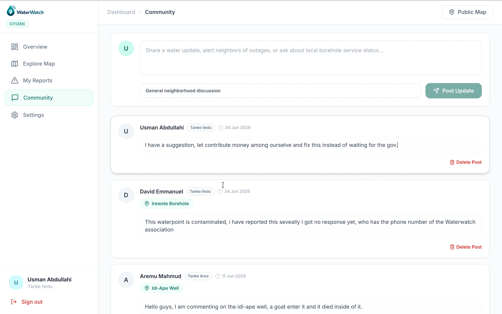

LGA-scoped community discussion board where citizens post updates about local water issues, tag specific waterpoints, and communicate with neighbours. Comments are displayed in reverse-chronological order.

---

## Architecture

```
┌─────────────────────────────────────────────────┐
│               PRESENTATION TIER                  │
│  Vite + React 18 (TypeScript) + TailwindCSS      │
│  React-Leaflet · React Router v6 · Lucide Icons  │
│  Deployed on: Vercel                             │
└─────────────────┬───────────────────────────────┘
                  │  HTTPS / REST (JSON)
                  │  JWT Access Token (Authorization header)
                  │  HttpOnly Refresh Cookie
┌─────────────────▼───────────────────────────────┐
│             APPLICATION LOGIC TIER               │
│  Node.js + Express.js                            │
│  Zod validation · Helmet · CORS · Rate Limiting  │
│  JWT (Access 15 min + Refresh 30 days)           │
│  Bcrypt (cost 12) · Nodemailer SMTP              │
│  Cloudinary SDK · express-rate-limit             │
│  Deployed on: Render                             │
└─────────────────┬───────────────────────────────┘
                  │  Mongoose ODM
┌─────────────────▼───────────────────────────────┐
│               DATA TIER                          │
│  MongoDB Atlas                                   │
│  6 collections: User · Waterpoint · FaultReport  │
│                 Comment · SystemSetting           │
│                 AdminInvite                       │
│  2dsphere spatial index on Waterpoint.location   │
│  Cloudinary CDN (images)                         │
└─────────────────────────────────────────────────┘
```

---

## Technology Stack

| Layer | Technology | Purpose |
|---|---|---|
| Frontend build | Vite 5 | Fast HMR, optimized production bundle |
| UI framework | React 18 (TypeScript) | Component-based SPA |
| Styling | TailwindCSS | Utility-first responsive design |
| Mapping | Leaflet.js + React-Leaflet | Interactive geospatial map |
| Tile layer | OpenStreetMap | Free, open map tiles |
| HTTP client | Native Fetch API (custom typed wrapper) | REST communication |
| Routing | React Router v6 | Client-side navigation with route guards |
| Backend runtime | Node.js (≥ 20) | Non-blocking I/O server |
| Web framework | Express.js | REST API routing and middleware |
| Validation | Zod | Schema-based request validation |
| Database | MongoDB Atlas | Document store with 2dsphere spatial index |
| ODM | Mongoose | Schema enforcement and typed queries |
| Authentication | JWT (jsonwebtoken) | Stateless access + refresh token pair |
| Password hashing | bcryptjs (cost 12) | Secure credential storage |
| Rate limiting | express-rate-limit | Brute-force and DDoS mitigation |
| Security headers | Helmet | XSS, clickjacking, MIME-sniffing protection |
| Image hosting | Cloudinary | CDN-backed photo storage |
| Email | Nodemailer (SMTP) | Verification, reset, and invite emails |
| API docs | Swagger / OpenAPI 3.0 | Interactive endpoint reference |
| Frontend deploy | Vercel | Edge CDN, automatic CI/CD |
| Backend deploy | Render | Node.js hosting with auto-deploy |

---

## Getting Started

### Prerequisites

- Node.js ≥ 20
- A MongoDB Atlas cluster (free tier works)
- A Cloudinary account (free tier works)
- An SMTP email account (Gmail App Password, Brevo, Resend, etc.)

### 1. Clone the repository

```bash
git clone https://github.com/Intelligence247/waterwatch.git
cd waterwatch
```

### 2. Install dependencies

```bash
# Backend
cd backend && npm install

# Frontend
cd ../frontend && npm install
```

### 3. Configure environment variables

```bash
# Backend
cp backend/.env.example backend/.env
# Edit backend/.env with your values (see Environment Variables below)

# Frontend
cp frontend/.env.example frontend/.env
# Set VITE_API_BASE_URL to your backend URL
```

### 4. Run in development

```bash
# Terminal 1 — backend (http://localhost:5000)
cd backend && npm run dev

# Terminal 2 — frontend (http://localhost:5173)
cd frontend && npm run dev
```

### 5. (Optional) Seed the database

```bash
cd backend && npm run seed
```

---

## Environment Variables

### Backend (`backend/.env`)

| Variable | Description | Example |
|---|---|---|
| `PORT` | Server port | `5000` |
| `NODE_ENV` | Environment | `development` or `production` |
| `MONGODB_URI` | MongoDB Atlas connection string | `mongodb+srv://...` |
| `JWT_ACCESS_SECRET` | Secret for signing access tokens | any long random string |
| `JWT_REFRESH_SECRET` | Secret for signing refresh tokens | different long random string |
| `CLIENT_ORIGIN` | Comma-separated allowed frontend origins | `http://localhost:5173` |
| `BACKEND_PUBLIC_URL` | Public URL of the backend (for email links) | `https://your-api.onrender.com` |
| `CLOUDINARY_CLOUD_NAME` | Cloudinary cloud name | `your-cloud-name` |
| `CLOUDINARY_API_KEY` | Cloudinary API key | `123456789` |
| `CLOUDINARY_API_SECRET` | Cloudinary API secret | `abc123...` |
| `EMAIL_HOST` | SMTP host | `smtp.gmail.com` |
| `EMAIL_PORT` | SMTP port | `587` |
| `EMAIL_USER` | SMTP username / email | `you@gmail.com` |
| `EMAIL_PASS` | SMTP password / app password | `xxxx xxxx xxxx xxxx` |
| `EMAIL_FROM` | Sender email address | `noreply@waterwatch.ng` |
| `EMAIL_FROM_NAME` | Sender display name | `WaterWatch` |
| `WATERPOINT_MIN_DISTANCE_METERS` | Auto-flag deduplication radius | `10` |
| `WATERPOINT_REVIEW_DISTANCE_METERS` | Community review deduplication radius | `30` |

### Frontend (`frontend/.env`)

| Variable | Description | Example |
|---|---|---|
| `VITE_API_BASE_URL` | Full URL of the backend API | `http://localhost:5000/api` |

---

## Project Structure

```
waterwatch/
├── backend/
│   └── src/
│       ├── app.js                    # Express app factory
│       ├── server.js                 # Server entry point
│       ├── config/
│       │   ├── env.js                # Environment variable loader
│       │   └── settings.js           # Cached SystemSetting loader
│       ├── controllers/
│       │   ├── analytics.controller.js
│       │   ├── auth.controller.js    # Register, login, invites, password reset
│       │   ├── comment.controller.js
│       │   ├── fault-report.controller.js
│       │   ├── setting.controller.js
│       │   ├── upload.controller.js
│       │   ├── user.controller.js    # User management (suspend/block)
│       │   └── waterpoint.controller.js  # CRUD + deduplication
│       ├── middleware/
│       │   ├── auth.js               # requireAuth, requireRole
│       │   ├── errorHandler.js
│       │   └── validate.js           # Zod validation wrapper
│       ├── models/
│       │   ├── admin-invite.model.js
│       │   ├── comment.model.js
│       │   ├── fault-report.model.js
│       │   ├── system-setting.model.js
│       │   ├── user.model.js
│       │   └── waterpoint.model.js   # 2dsphere index, dedup fields
│       ├── routes/
│       ├── services/
│       │   ├── cloudinary.service.js
│       │   └── email.service.js      # Verification, reset, invite emails
│       ├── utils/
│       │   └── tokens.js             # JWT sign/verify, hash helpers
│       └── validators/               # Zod schemas per resource
│
└── frontend/
    └── src/
        ├── components/
        │   ├── admin/AdminLayout.tsx
        │   ├── citizen/CitizenLayout.tsx
        │   └── ui/                   # Toast, ConfirmDialog
        ├── contexts/AuthContext.tsx
        ├── hooks/useInView.ts
        ├── lib/
        │   ├── apiClient.ts          # Typed Fetch wrapper
        │   ├── geolocation.ts        # Progressive GPS capture engine
        │   ├── types.ts
        │   └── *Api.ts               # Per-resource API modules
        └── pages/
            ├── admin/
            │   ├── DashboardOverview.tsx   # KPI cards, donut chart
            │   ├── AdminDedupePage.tsx     # Deduplication portal
            │   ├── AdminSettingsPage.tsx   # Configurable thresholds
            │   ├── AdminInvitesPage.tsx
            │   ├── ReportsPage.tsx
            │   ├── UsersPage.tsx
            │   └── WaterpointsPage.tsx
            ├── citizen/
            │   ├── CitizenOverview.tsx
            │   ├── CitizenExplorePage.tsx
            │   ├── CitizenReportsPage.tsx
            │   └── CitizenCommunityPage.tsx
            ├── auth/                       # Login, Register, ForgotPassword, ResetPassword, VerifyEmail
            ├── LandingPage.tsx
            └── MapPage.tsx                 # Public Leaflet map
```

---

## API Overview

All routes are prefixed with `/api`. Interactive documentation is available at `/api-docs` (Swagger UI).

| Resource | Endpoint | Auth Required |
|---|---|---|
| Auth | `POST /auth/register` | No |
| Auth | `POST /auth/login` | No |
| Auth | `POST /auth/refresh` | No (cookie) |
| Auth | `POST /auth/forgot-password` | No |
| Auth | `POST /auth/reset-password` | No |
| Auth | `GET /auth/me` | Citizen / Admin |
| Auth | `POST /auth/admin-invites` | Admin |
| Waterpoints | `GET /waterpoints` | No (citizens auto-scoped by LGA) |
| Waterpoints | `POST /waterpoints` | Admin |
| Waterpoints | `PATCH /waterpoints/:id` | Admin |
| Waterpoints | `DELETE /waterpoints/:id` | Admin |
| Waterpoints | `GET /waterpoints/dedupe/queue` | Admin |
| Waterpoints | `POST /waterpoints/:id/dedupe/resolve` | Admin |
| Fault Reports | `POST /fault-reports` | Citizen |
| Fault Reports | `GET /fault-reports` | Citizen (own) / Admin (all) |
| Fault Reports | `PATCH /fault-reports/:id/status` | Admin |
| Users | `GET /users` | Admin |
| Users | `PATCH /users/:id/status` | Admin |
| Comments | `GET /comments` | Citizen |
| Comments | `POST /comments` | Citizen |
| Analytics | `GET /analytics/admin-overview` | Admin |
| Analytics | `GET /analytics/citizen-overview` | Citizen |
| Settings | `GET /settings` | Admin |
| Settings | `PATCH /settings` | Admin |
| Upload | `POST /uploads/image` | Citizen / Admin |
| Health | `GET /health` | No |

---

## Security

| Control | Implementation |
|---|---|
| Password hashing | bcryptjs, cost factor 12 |
| Access tokens | JWT, 15-minute expiry |
| Refresh tokens | JWT, 30-day expiry, stored as SHA-256 hash in MongoDB, rotated on every use |
| Session transport | HttpOnly + Secure + SameSite cookie |
| Token invalidation | Server-side hash check; logout clears hash; account suspension kills session |
| RBAC | `requireAuth` + `requireRole("admin")` middleware on all protected routes |
| Rate limiting | 200 req / IP / 15 min (global); 50 req / IP / 15 min (auth endpoints) |
| HTTP headers | Helmet: CSP, X-Frame-Options, X-Content-Type-Options, HSTS |
| CORS | Production: allowlist of trusted frontend origins only |
| Input validation | Zod schema validation on every request body, query, and route param |
| Image uploads | Cloudinary SDK; files never written to the Node.js filesystem |

---

## Acknowledgements

- **Supervisor:** [Your supervisor's name], Department of Information Technology, University of Ilorin
- **Mapping:** [OpenStreetMap](https://www.openstreetmap.org/) contributors — map data licensed under ODbL
- **Frameworks & Libraries:** Vite, React, Leaflet.js, Express.js, MongoDB / Mongoose, TailwindCSS, Cloudinary, Nodemailer
- **Icons:** [Lucide React](https://lucide.dev/)

---

<div align="center">
  <p>Developed by <strong>Usman Abdullahi Babatunde</strong> — Matric No. 21/52HL147</p>
  <p>B.Sc. Information Technology · University of Ilorin · 2025/2026</p>
</div>
