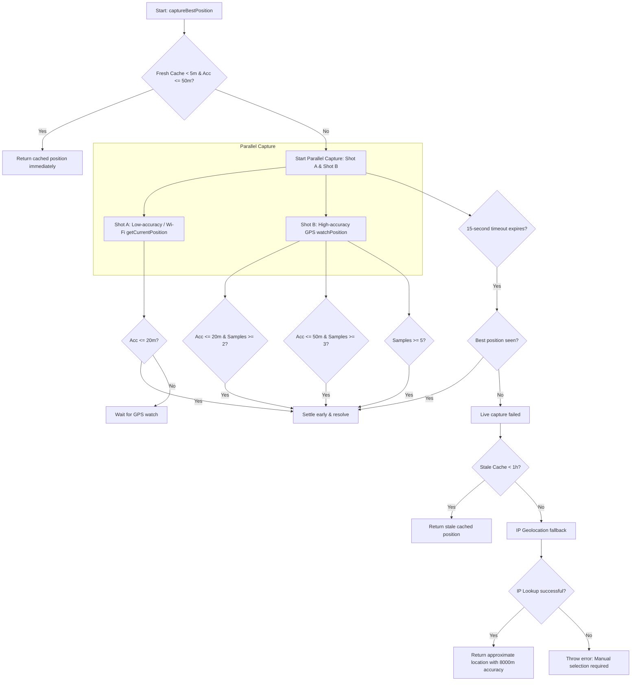

# Geolocation & Location Tracking Implementation Report

This report explains the robust, cross-platform location capture system implemented in the **Waterwatch** project. It details the technical strategy, API/library usage, accuracy management, UI integration, and how this architecture can be ported to another project.

---

## 1. Key Libraries & APIs Used

The project relies on a mix of native browser APIs, third-party mapping libraries, and public IP geolocation endpoints:

1. **HTML5 Geolocation API (Native Browser API)**
   - `navigator.geolocation.getCurrentPosition`: Used for quick, one-off location queries.
   - `navigator.geolocation.watchPosition`: Used to stream continuous location updates to warm up the device's GPS hardware.
   - `navigator.geolocation.clearWatch`: Cleans up the active streaming watch when a precise lock is found or the timeout expires.

2. **Leaflet & React-Leaflet**
   - **Leaflet (`leaflet`)**: Lightweight open-source JavaScript library for interactive maps.
   - **React-Leaflet (`react-leaflet`)**: React wrappers for Leaflet components. Used to render interactive maps, display markers, and support manual pinning ("Pick on map") to allow users to refine their location.

3. **Public IP Geolocation APIs (JSON fallbacks)**
   - Used to resolve the user's approximate coordinates when GPS/Wi-Fi captures fail or permissions are blocked:
     - `https://get.geojs.io/v1/ip/geo.json` (Primary network fallback)
     - `https://ipapi.co/json/` (Secondary fallback)
     - `https://ipwho.is/json/` (Tertiary fallback)

4. **Web Browser LocalStorage**
   - Cache keys under `'waterwatch:lastKnownLocation'` are used to persist captured positions, avoiding redundant GPS queries when a user submits multiple forms sequentially.

---

## 2. The Progressive Fallback Strategy

The core capture function, `captureBestPosition()`, uses a highly reliable multi-tiered strategy designed to avoid the "macOS location stall" bug (where the browser hangs infinitely trying to find a high-accuracy GPS fix on devices without a GPS chip).

The sequence operates as follows:



### Detailed Breakdown of the Steps:

1. **Step 1: Fresh Cache Fast-Path**
   - Checks if a cached position exists in `localStorage` that is **less than 5 minutes old** and has an accuracy of **$\le 50$ meters**. If found, it returns it instantly, keeping the UI snappy.
2. **Step 2: Live Parallel Capture**
   - **Shot A (Wi-Fi/Network)**: Requests a low-accuracy position (`enableHighAccuracy: false`, `timeout: 7000`, `maximumAge: 0`). This responds rapidly (1–3 seconds) on laptops or desktops connected to Wi-Fi.
   - **Shot B (GPS Watch)**: Starts a high-accuracy watch (`enableHighAccuracy: true`, `timeout: 15000`, `maximumAge: 0`). GPS chips on phones often require several seconds to acquire a stable satellite fix, making the first readings highly inaccurate. The watch tracks each new reading, retaining only the one with the best accuracy.
   - **Early Exit Rules**:
     - Accuracy $\le 20$ meters and at least 2 samples received.
     - Accuracy $\le 50$ meters and at least 3 samples received (handles slower GPS hardware).
     - $\ge 5$ samples received (handles desktop Wi-Fi plateaus where accuracy won't improve further).
     - **15-second total timeout**: If none of the early exit rules are met, the watch is cleared, and the best position captured by either Shot A or Shot B is returned.
3. **Step 3: Stale Cache Fallback**
   - If the live capture fails (e.g. timeout on a device with disabled Wi-Fi/location service), it looks for a cached position up to **1 hour old**.
4. **Step 4: IP-Based Geolocation Fallback**
   - If no cached location exists, it fetches from a sequence of public IP geolocation endpoints. This returns a city-level estimate, assigning a synthetic accuracy of **8,000 meters** (so the system knows it is approximate).

---

## 3. How Accuracy is Managed & Normalised

Location accuracy is managed through specific thresholds and normalisation before saving coordinates to the database:

### Constants
* **`LOCATION_TARGET_ACCURACY_METERS = 20`**: Settle immediately if reached.
* **`LOCATION_MAX_ACCEPTABLE_ACCURACY_METERS = 50`**: Maximum threshold for a "high-quality" coordinate.
* **`APPROXIMATE_NETWORK_ACCURACY_METERS = 8000`**: Hardcoded accuracy for IP-based geolocation.

### Normalisation Function
The `normalizeCapturedPosition` helper formats coordinates and handles the gating of precision:

```typescript
export function normalizeCapturedPosition(position: GeolocationPosition) {
  const acc = Number.isFinite(position.coords.accuracy) ? position.coords.accuracy : null;
  const isApproximateNetwork = acc !== null && acc >= APPROXIMATE_NETWORK_ACCURACY_METERS * 0.75;

  // Round coordinates to 6 decimal places (approx. 11 cm precision)
  const latitude = position.coords.latitude.toFixed(6);
  const longitude = position.coords.longitude.toFixed(6);

  // If precision is within acceptable limit (<= 50m), return the accuracy in meters
  if (acc !== null && acc <= LOCATION_MAX_ACCEPTABLE_ACCURACY_METERS) {
    return { latitude, longitude, capturedAccuracyMeters: acc, isApproximateNetwork: false };
  }
  
  // If the reading is too coarse (like IP geo), clear the accuracy field so the UI knows it's unverified
  return { latitude, longitude, capturedAccuracyMeters: null, isApproximateNetwork };
}
```

### UI and Database Gating
* **Gating**: By returning `capturedAccuracyMeters: null` for low-precision readings, the UI can warn the user that their location is approximate and suggest they refine the pin manually on the Leaflet map.
* **Warnings**:
  - `isApproximateNetwork === true` $\rightarrow$ Warn: "Approximate network location (city-level). Prefer the Explore map to tap an exact spot."
  - `capturedAccuracyMeters === null` $\rightarrow$ Warn: "Location applied with moderate precision. Use the Explore map to refine if needed."

---

## 4. UI/UX Integration Pattern

The UI components (such as `CitizenReportsPage.tsx`) use state variables to handle the locating states and report exact phases to the user:

```typescript
const [locating, setLocating] = useState(false);
const [locationPhase, setLocationPhase] = useState<LocationPhase | null>(null);

const getMyLocation = async () => {
  setLocating(true);
  setLocationPhase(null);
  try {
    // Pass a progress callback to receive current location acquisition phase
    const position = await captureBestPosition((phase) => setLocationPhase(phase));
    const n = normalizeCapturedPosition(position);
    
    setForm(prev => ({ ...prev, latitude: n.latitude, longitude: n.longitude }));
    setCapturedAccuracyMeters(n.capturedAccuracyMeters);
    
    // Toast alerts based on precision levels
    if (n.isApproximateNetwork) {
      toast('warning', 'Approximate network location...');
    } else if (n.capturedAccuracyMeters === null) {
      toast('warning', 'Location applied with moderate precision...');
    } else {
      toast('success', `Location captured with ±${Math.round(n.capturedAccuracyMeters)} m accuracy.`);
    }
  } catch (error) {
    toast('error', geolocationFailureMessage(error));
  } finally {
    setLocating(false);
    setLocationPhase(null);
  }
};
```

### Displaying Status Messages Based on Phase:
The UI changes label and icon dynamically based on the current search phase:
* **`wifi`** $\rightarrow$ Button text: *"Wi-Fi fix..."*, Icon: `Wifi`
* **`gps`** $\rightarrow$ Button text: *"GPS warm-up..."*, Icon: `Satellite` (shows a warning: *"GPS warm-up in progress — can take up to 15 s on first use."*)
* **`network`** $\rightarrow$ Button text: *"Network location..."*, Icon: `Wifi`
* **Default** $\rightarrow$ Button text: *"Locating..."*, Icon: `Loader2` (spinning)

---

## 5. Portability Guide: Reusing This in Another Project

To replicate this robust system in a new project, copy/paste the following boilerplate code.

### Geolocation Utility (`geolocation.ts`)

Create `geolocation.ts` in your utilities directory:

```typescript
export const LOCATION_TARGET_ACCURACY_METERS = 20;
export const LOCATION_MAX_ACCEPTABLE_ACCURACY_METERS = 50;
export const LOCATION_MIN_SAMPLES = 2;

const GPS_WATCH_WINDOW_MS = 15_000;
const WIFI_QUICK_TIMEOUT_MS = 7_000;

const LOCATION_CACHE_KEY = 'app:lastKnownLocation';
const FRESH_CACHE_MAX_AGE_MS = 5 * 60 * 1000; 
const STALE_CACHE_MAX_AGE_MS = 60 * 60 * 1000;

export const APPROXIMATE_NETWORK_ACCURACY_METERS = 8_000;

export type LocationPhase = 'wifi' | 'gps' | 'cache' | 'network';

function getCurrentPositionOnce(options: PositionOptions): Promise<GeolocationPosition> {
  return new Promise((resolve, reject) => {
    navigator.geolocation.getCurrentPosition(resolve, reject, options);
  });
}

function saveCachedLocation(position: GeolocationPosition): void {
  try {
    const payload = {
      latitude: position.coords.latitude,
      longitude: position.coords.longitude,
      accuracy: Number.isFinite(position.coords.accuracy) ? position.coords.accuracy : 150,
      timestamp: Date.now(),
    };
    window.localStorage.setItem(LOCATION_CACHE_KEY, JSON.stringify(payload));
  } catch {}
}

function readCachedLocation(maxAgeMs: number): GeolocationPosition | null {
  try {
    const raw = window.localStorage.getItem(LOCATION_CACHE_KEY);
    if (!raw) return null;
    const parsed = JSON.parse(raw);
    if (Date.now() - parsed.timestamp > maxAgeMs) return null;
    return {
      coords: {
        latitude: parsed.latitude,
        longitude: parsed.longitude,
        accuracy: parsed.accuracy,
        altitude: null, altitudeAccuracy: null, heading: null, speed: null,
      },
      timestamp: parsed.timestamp,
    } as GeolocationPosition;
  } catch {
    return null;
  }
}

async function fetchJsonWithTimeout(url: string, ms: number): Promise<any> {
  const controller = new AbortController();
  const t = window.setTimeout(() => controller.abort(), ms);
  try {
    const res = await fetch(url, { signal: controller.signal });
    return res.ok ? await res.json() : null;
  } catch {
    return null;
  } finally {
    window.clearTimeout(t);
  }
}

function parseLatLng(data: any) {
  if (!data || typeof data !== 'object') return null;
  const lat = parseFloat(data.latitude ?? data.lat);
  const lng = parseFloat(data.longitude ?? data.lng ?? data.lon);
  return Number.isNaN(lat) || Number.isNaN(lng) ? null : { lat, lng };
}

export async function fetchApproximateLocationByNetwork(): Promise<GeolocationPosition | null> {
  const endpoints = [
    { url: 'https://get.geojs.io/v1/ip/geo.json', extract: parseLatLng },
    { url: 'https://ipapi.co/json/', extract: parseLatLng },
    {
      url: 'https://ipwho.is/json/',
      extract: (j: any) => j?.success !== false ? parseLatLng(j) : null
    },
  ];
  for (const { url, extract } of endpoints) {
    try {
      const json = await fetchJsonWithTimeout(url, 6500);
      const ll = extract(json);
      if (ll) {
        return {
          coords: {
            latitude: ll.lat, longitude: ll.lng,
            accuracy: APPROXIMATE_NETWORK_ACCURACY_METERS,
            altitude: null, altitudeAccuracy: null, heading: null, speed: null,
          },
          timestamp: Date.now(),
        } as GeolocationPosition;
      }
    } catch {}
  }
  return null;
}

function captureWithProgressiveStrategy(
  onProgress?: (phase: LocationPhase) => void,
): Promise<GeolocationPosition> {
  return new Promise((resolve, reject) => {
    let settled = false;
    let bestPosition: GeolocationPosition | null = null;
    let gpsSamples = 0;
    let watchId: number | null = null;
    let windowTimer: any = null;

    const tryUpdate = (pos: GeolocationPosition) => {
      const acc = Number.isFinite(pos.coords.accuracy) ? pos.coords.accuracy : Infinity;
      const best = bestPosition?.coords.accuracy ?? Infinity;
      if (!bestPosition || acc < best) bestPosition = pos;
    };

    const cleanup = () => {
      if (watchId !== null) navigator.geolocation.clearWatch(watchId);
      if (windowTimer !== null) clearTimeout(windowTimer);
    };

    const finish = () => {
      if (settled) return;
      settled = true;
      cleanup();
      if (bestPosition) resolve(bestPosition);
      else reject(new Error('No position obtained.'));
    };

    // Shot A: Wi-Fi quick-shot
    onProgress?.('wifi');
    getCurrentPositionOnce({ enableHighAccuracy: false, maximumAge: 0, timeout: WIFI_QUICK_TIMEOUT_MS })
      .then((pos) => {
        if (settled) return;
        tryUpdate(pos);
        if (pos.coords.accuracy <= LOCATION_TARGET_ACCURACY_METERS) finish();
      }).catch(() => {});

    // Shot B: GPS watch
    onProgress?.('gps');
    watchId = navigator.geolocation.watchPosition(
      (pos) => {
        if (settled) return;
        gpsSamples++;
        tryUpdate(pos);
        const acc = pos.coords.accuracy;
        if (acc <= LOCATION_TARGET_ACCURACY_METERS && gpsSamples >= LOCATION_MIN_SAMPLES) finish();
        else if (acc <= LOCATION_MAX_ACCEPTABLE_ACCURACY_METERS && gpsSamples >= 3) finish();
        else if (gpsSamples >= 5) finish();
      },
      (err) => {
        if (err.code === err.PERMISSION_DENIED) {
          settled = true;
          cleanup();
          reject(err);
        }
      },
      { enableHighAccuracy: true, maximumAge: 0, timeout: GPS_WATCH_WINDOW_MS }
    );

    windowTimer = setTimeout(finish, GPS_WATCH_WINDOW_MS);
  });
}

export async function captureBestPosition(
  onProgress?: (phase: LocationPhase) => void,
): Promise<GeolocationPosition> {
  if (!navigator.geolocation) throw new Error('Geolocation not supported.');

  // 1. Fresh Cache Fast-Path
  const fresh = readCachedLocation(FRESH_CACHE_MAX_AGE_MS);
  if (fresh && fresh.coords.accuracy <= LOCATION_MAX_ACCEPTABLE_ACCURACY_METERS) {
    onProgress?.('cache');
    return fresh;
  }

  // 2. Live Capture
  try {
    const pos = await captureWithProgressiveStrategy(onProgress);
    saveCachedLocation(pos);
    return pos;
  } catch (err: any) {
    if (err.code === 1) throw err; // Denied permission
  }

  // 3. Stale Cache
  const stale = readCachedLocation(STALE_CACHE_MAX_AGE_MS);
  if (stale) {
    onProgress?.('cache');
    return stale;
  }

  // 4. IP fallback
  onProgress?.('network');
  const net = await fetchApproximateLocationByNetwork();
  if (net) return net;

  throw new Error('Unable to capture location.');
}

export function getPositionErrorCode(error: any): number | null {
  return error && typeof error === 'object' && 'code' in error ? error.code : null;
}

export function geolocationFailureMessage(error: any): string {
  const code = getPositionErrorCode(error);
  if (code === 1) return 'Location permission denied. Please enable in settings.';
  if (code === 2) return 'Position unavailable. Use the map or check Wi-Fi connection.';
  if (code === 3) return 'Location request timed out.';
  return 'Unable to determine location.';
}

export function normalizeCapturedPosition(position: GeolocationPosition) {
  const acc = Number.isFinite(position.coords.accuracy) ? position.coords.accuracy : null;
  const isApproximateNetwork = acc !== null && acc >= APPROXIMATE_NETWORK_ACCURACY_METERS * 0.75;
  const latitude = position.coords.latitude.toFixed(6);
  const longitude = position.coords.longitude.toFixed(6);

  if (acc !== null && acc <= LOCATION_MAX_ACCEPTABLE_ACCURACY_METERS) {
    return { latitude, longitude, capturedAccuracyMeters: acc, isApproximateNetwork: false };
  }
  return { latitude, longitude, capturedAccuracyMeters: null, isApproximateNetwork };
}
```
